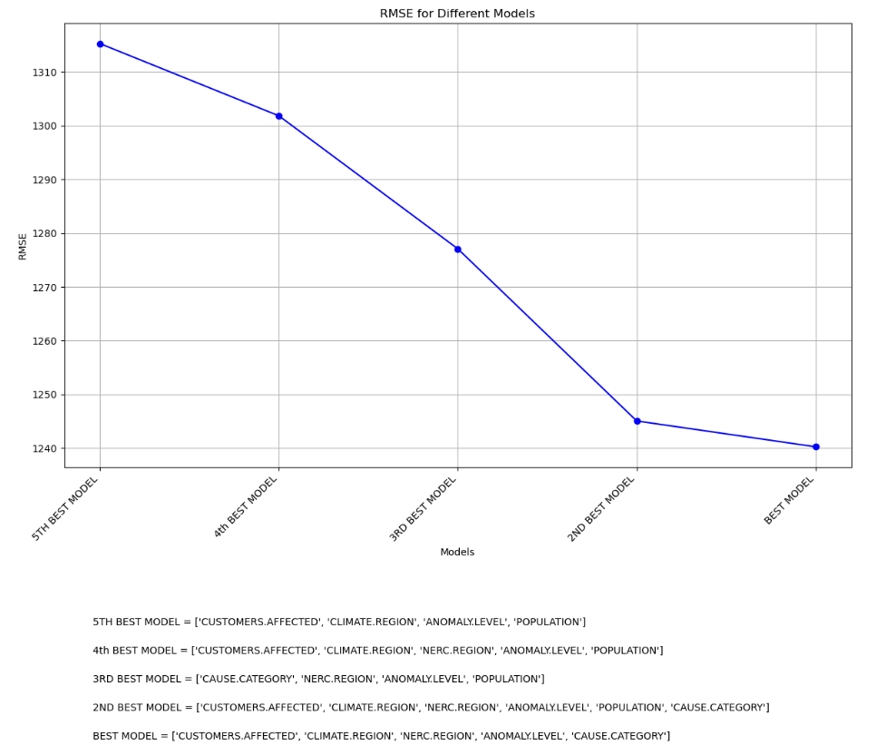

# Analyzing Power Outages 🔌
Project for DSC80 UCSD
by Christian Guerra and Avi Mehta

## Introduction
In this project, my team and I undertook a comprehensive analysis of a dataset containing information about power outages across various states in the United States. Power outages are significant events that can have wide-ranging impacts on communities, economies, and public safety. Understanding the causes and characteristics of these outages is crucial for improving the resilience of the power grid and enhancing the reliability of electricity supply.

The central question of our project is: **"How does the climate region affect the duration of power outages?"**

This question is particularly important because the duration of a power outage can have substantial effects on the affected population, including economic losses, disruptions to daily life, and risks to public safety. By understanding how climate regions influence outage durations, utility companies and policymakers can develop targeted strategies to address vulnerabilities specific to different climatic conditions, ultimately improving the efficiency of response efforts and minimizing the impacts of outages.

## Data Cleaning and Exploratory Data Analysis

### Data Cleaning and Preprocessing
 1. **Dropping the "Units" Row:**
   The first row after skipping the metadata contained units instead of data, so we dropped it.

    ```python
    data = data.drop(index=0)
    ```

2. **Mean Imputation for Numerical Columns:**
   For numerical columns, we replaced missing values with the mean value of each column. This included columns such as `OUTAGE.DURATION`, `CUSTOMERS.AFFECTED`, `ANOMALY.LEVEL`, `POPULATION`, and `DEMAND.LOSS.MW`.

    ```python
    numerical_col = ['OUTAGE.DURATION', "CUSTOMERS.AFFECTED", "ANOMALY.LEVEL", 'POPULATION', 'DEMAND.LOSS.MW']
    for col in numerical_col:
        data[col] = pd.to_numeric(data[col])
        data[col].fillna(data[col].mean(), inplace=True)
    ```

3. **Mode Imputation for Categorical Columns:**
   For categorical columns, we replaced missing values with the most frequent value (mode) of each column. This included columns such as `CLIMATE.REGION`, `CAUSE.CATEGORY`, `NERC.REGION`, `U.S._STATE`, and `MONTH`.

    ```python
    catagorical_col = ['CLIMATE.REGION', 'CAUSE.CATEGORY', 'NERC.REGION', 'U.S._STATE', 'MONTH']
    for col in catagorical_col:
        data[col].fillna(data[col].mode()[0], inplace=True)
    ```

4. **Combining Date and Time Columns:**
   We combined `OUTAGE.START.DATE` and `OUTAGE.START.TIME` to create a single `OUTAGE_START_DATETIME` column, and similarly, combined `OUTAGE.RESTORATION.DATE` and `OUTAGE.RESTORATION.TIME` to create a single `OUTAGE_RESTORATION_DATETIME` column. This helped reduce redundancy and simplified the dataset.

    ```python
    data['OUTAGE_START_DATETIME'] = pd.to_datetime(data['OUTAGE.START.DATE'] + ' ' + data['OUTAGE.START.TIME'], errors='coerce')
    data['OUTAGE_RESTORATION_DATETIME'] = pd.to_datetime(data['OUTAGE.RESTORATION.DATE'] + ' ' + data['OUTAGE.RESTORATION.TIME'], errors='coerce')
    ```

5. **Dropping Old Date and Time Columns:**
   After creating the datetime columns, we dropped the original date and time columns to avoid redundancy.

    ```python
    data = data.drop(columns=['OUTAGE.START.DATE', 'OUTAGE.START.TIME', 'OUTAGE.RESTORATION.DATE', 'OUTAGE.RESTORATION.TIME'])
    ```


### Data Description
The original raw dataset contains 1534 rows, corresponding to 1534 outages, and 57 columns. For the purpose of our analysis, we focused on the following columns:

| Columns | Description |
| ------- | ----------- |
| `OUTAGE_START_DATETIME` | Combined datetime of outage start |
| `OUTAGE_RESTORATION_DATETIME` | Combined datetime of outage restoration |
| `NERC.REGION` | North American Electric Reliability Corporation (NERC) regions involved in the outage event |
| `CUSTOMERS.AFFECTED` | Number of customers affected by the power outage event |
| `OUTAGE.DURATION` | Duration of outage events (in minutes) |
| `CLIMATE.REGION` | U.S. Climate regions as specified by National Centers for Environmental Information |
| `CAUSE.CATEGORY` | Categories of all the events causing the major power outages |
| `ANOMALY.LEVEL` | Gravity of natural disaster on power outage |
| `U.S._STATE` | State in which the outage occurred |
| `POPULATION` | Population of the affected area |
| `DEMAND.LOSS.MW` | Demand loss in megawatts |
| `MONTH` | Month in which the outage occurred |
| `YEAR` | Year in which the outage occurred |

### Cleaned Data Example
Here is an example of the cleaned dataset:

| OUTAGE_START_DATETIME  | OUTAGE_RESTORATION_DATETIME | NERC.REGION | CUSTOMERS.AFFECTED | OUTAGE.DURATION | CLIMATE.REGION     | CAUSE.CATEGORY    | ANOMALY.LEVEL | U.S._STATE | POPULATION | DEMAND.LOSS.MW | MONTH | YEAR  |
|------------------------|-----------------------------|-------------|--------------------|-----------------|--------------------|-------------------|---------------|------------|------------|----------------|-------|-------|
| 2011-07-01 17:00:00    | 2011-07-03 20:00:00         | MRO         | 70000.000000       | 3060.0          | East North Central | severe weather    | -0.3          | Minnesota  | 5348119.0  | 536.287093     | 7.0   | 2011  |
| 2014-05-11 18:38:00    | 2014-05-11 18:39:00         | MRO         | 143456.222731      | 1.0             | East North Central | intentional attack | -0.1          | Minnesota  | 5457125.0  | 536.287093     | 5.0   | 2014  |
| 2010-10-26 20:00:00    | 2010-10-28 22:00:00         | MRO         | 70000.000000       | 3000.0          | East North Central | severe weather    | -1.5          | Minnesota  | 5310903.0  | 536.287093     | 10.0  | 2010  |
| 2012-06-19 04:30:00    | 2012-06-20 23:00:00         | MRO         | 68200.000000       | 2550.0          | East North Central | severe weather    | -0.1          | Minnesota  | 5380443.0  | 536.287093     | 6.0   | 2012  |
| 2015-07-18 02:00:00    | 2015-07-19 07:00:00         | MRO         | 250000.000000      | 1740.0          | East North Central | severe weather    | 1.2           | Minnesota  | 5489594.0  | 250.000000     | 7.0   | 2015  |

### Exploratory Data Analysis (EDA)
We conducted EDA to understand the distribution and characteristics of the outages, visualizing the data to identify key trends and patterns.

#### Univariate Analysis

<iframe src="assets/climate_region_distribution.html" width="800" height="600" frameborder="0"></iframe>

The graph above represents the distribution of power outages across different climate regions in the United States. This bar plot provides a visual summary of the number of outages recorded in each climate region.

**X-Axis (Index):**
The x-axis represents the different climate regions. Each label on the x-axis corresponds to a specific climate region as defined by the National Centers for Environmental Information. The climate regions included in this dataset are:

- Northeast
- South
- West
- Central
- Southeast
- East North Central
- Northwest
- Southwest
- West North Central

**Y-Axis (Value):**
The y-axis represents the number of power outages. This value indicates how many power outage events were recorded in each respective climate region.

**Observations:**
- The Northeast region has the highest number of recorded power outages, with a count nearing 350 events.
- The South, West, and Central regions also have a relatively high number of outages, each with counts exceeding 200 events.
- The Southeast, East North Central, and Northwest regions have moderate numbers of outages, ranging from approximately 100 to 150 events.
- The Southwest and West North Central regions have the fewest recorded outages, with the West North Central region having significantly fewer events compared to other regions.

This distribution highlights that some regions experience a higher frequency of power outages compared to others. Understanding these regional differences is crucial for targeted improvements in power grid resilience and outage management. The graph helps identify regions that may require more robust infrastructure or more efficient outage response strategies.


#### Bivariate Analysis
**Observations:**
- The plot below shows a wide dispersion of points, indicating significant variability in both outage duration and the number of customers affected.
- There are several clusters of points, especially around shorter outage durations (less than 1000 minutes) and varying numbers of affected customers.
- Some points represent extreme values, with outages lasting up to 7000 minutes and affecting up to 300,000 customers.

<iframe src="assets/outage_duration_vs_customers_affected.html" width="800" height="600" frameborder="0"></iframe>

#### Interesting Aggregates
The pivot table displayed below shows the impact of power outages in different U.S. climate regions. It summarizes the number of outages, the average length of outage duration, and the average number of customers affected per outage. This analysis provides insights into how different climate regions are affected by power outages and the typical duration of these outages.

| CLIMATE.REGION     | Amount of Outages | Average Length of Outage Duration (minutes) | Average Number of Customers Affected |
|--------------------|-------------------|---------------------------------------------|---------------------------------------|
| Central            | 166               | 1424.87                                     | [Insert Value]                        |
| East North Central | 110               | 2666.07                                     | [Insert Value]                        |
| Northeast          | 296               | 1394.34                                     | [Insert Value]                        |
| Northwest          | 125               | 1004.59                                     | [Insert Value]                        |
| South              | 190               | 1211.80                                     | [Insert Value]                        |

- **Central**: The Central region experienced 166 outages with an average duration of approximately 1424.87 minutes. The average number of customers affected per outage in this region can provide further insights.
- **East North Central**: This region had 110 outages with a significantly higher average duration of 2666.07 minutes, indicating potentially more severe outages or slower restoration times.
- **Northeast**: With 296 outages, the Northeast region saw an average outage duration of 1394.34 minutes, which is relatively moderate compared to other regions.
- **Northwest**: The Northwest experienced 125 outages with the shortest average duration of 1004.59 minutes, suggesting more efficient outage management.
- **South**: The South region had 190 outages with an average duration of 1211.80 minutes.

The pivot table reveals that different climate regions experience varying frequencies and durations of power outages. These differences could be attributed to regional climatic conditions, infrastructure robustness, and efficiency of the power restoration processes.

By analyzing this data, utility companies and policymakers can identify regions that may require improved infrastructure or more efficient restoration protocols to reduce the impact of power outages on customers.

## Assessment of Missingness

### NMAR Analysis
To determine whether data are likely NMAR (Not Missing At Random), we must reason about the data-generating process. In our dataset, if the missingness of the `OUTAGE.DURATION` is due to factors not recorded in the dataset, such as manual errors during data entry or specific reporting practices of certain regions, it could be NMAR. However, we cannot conclude this solely by looking at the data. Additional information about the data collection process would be necessary to determine NMAR.

### Missingness Dependency
We analyzed the dependency of the missingness of the `OUTAGE.DURATION` column on other columns in the dataset by performing permutation tests.

### Missingness Summary

| Column                      | Missingness Proportion |
|-----------------------------|------------------------|
| OUTAGE_START_DATETIME       | 0.005867               |
| OUTAGE_RESTORATION_DATETIME | 0.037810               |
| NERC.REGION                 | 0.000000               |
| CUSTOMERS.AFFECTED          | 0.288787               |
| OUTAGE.DURATION             | 0.037810               |
| CLIMATE.REGION              | 0.003911               |
| CAUSE.CATEGORY              | 0.000000               |
| ANOMALY.LEVEL               | 0.005867               |
| MONTH                       | 0.005867               |
| OUTAGE_DURATION_MISSING     | 0.000000               |

### Permutation Test Results
#### Categorical Column: CAUSE.CATEGORY
- Observed Statistic: 0.2520091580226147
- P-value: 0.0

#### Categorical Column: CLIMATE.REGION
- Observed Statistic: 0.2535212947392274
- P-value: 0.004

#### Categorical Column: NERC.REGION
- Observed Statistic: 0.3153910849453322
- P-value: 0.0

#### Categorical Column: ANOMALY.LEVEL
- Observed Statistic: 0.4918007853547923
- P-value: 0.0

#### Categorical Column: MONTH
- Observed Statistic: 0.22267850229522704
- P-value: 0.118

### Interpretation
The p-values obtained from the permutation tests indicate that the missingness of the `OUTAGE.DURATION` column is dependent on `CAUSE.CATEGORY`, `CLIMATE.REGION`, `NERC.REGION`, and `ANOMALY.LEVEL` (p-value < 0.05). However, the missingness of `OUTAGE.DURATION` is not dependent on `MONTH` (p-value = 0.118).

### Detailed Analysis
#### MONTH
The p-value of 0.118 for the `MONTH` column suggests that the missingness of `OUTAGE.DURATION` is not significantly dependent on the month in which the outage occurred. This implies that the occurrence of missing data for outage duration does not vary significantly across different months. The permutation test's observed statistic for `MONTH` fell within the distribution of the permuted statistics, indicating no strong relationship between `MONTH` and missingness in `OUTAGE.DURATION`.

#### CLIMATE.REGION
On the other hand, the `CLIMATE.REGION` column shows a significant dependency on the missingness of `OUTAGE.DURATION` with a p-value of 0.004. This indicates that the missing data for outage duration is not uniformly distributed across different climate regions. The observed statistic for `CLIMATE.REGION` is significantly higher than most of the permuted statistics, suggesting that certain climate regions may have more or less missing data, possibly due to varying reporting standards or environmental factors affecting data collection.

### Graphs
#### Permutation Test: MONTH and Missingness of OUTAGE_DURATION
The following plot shows the distribution of test statistics from the permutation test for the `MONTH` column. The red dashed line represents the observed test statistic.

<iframe src="assets/permutation_test_MONTH.html" width="800" height="600" frameborder="0"></iframe>

#### Permutation Test: CAUSE.CATEGORY and Missingness of OUTAGE_DURATION
The following plot shows the distribution of test statistics from the permutation test for the `CAUSE.CATEGORY` column. The red dashed line represents the observed test statistic.

<iframe src="assets/permutation_test_CAUSE_CATEGORY.html" width="800" height="600" frameborder="0"></iframe>

## Hypothesis Testing
We formulated and tested hypotheses to explore the relationship between climate regions and the duration of power outages. Specifically, we examined if the climate region has an effect on the duration of power outages.

### Null Hypothesis (H₀)
The climate region has no effect on the duration of power outages.

### Alternative Hypothesis (H₁)
The climate region does have an effect on the duration of power outages.

### Permutation Test
To test these hypotheses, we performed a permutation test with the following steps:

1. **Calculate the Observed Statistic:**
   - We calculated the difference in means of `OUTAGE.DURATION` across different `CLIMATE.REGION` values.

2. **Generate Permutation Samples:**
   - We randomly shuffled the `CLIMATE.REGION` labels and recalculated the difference in means to generate a distribution of the test statistic under the null hypothesis.

3. **Calculate P-value:**
   - We computed the p-value by comparing the observed test statistic to the distribution of permuted test statistics.

### Results
The observed statistic and p-value obtained from the permutation test are as follows:

- **Observed Statistic:** 931.7692073170731
- **P-value:** 0.453

#### Interpretation
Since the p-value is greater than 0.05, we fail to reject the Null Hypothesis. This suggests that there is no significant effect of climate regions on the duration of power outages.

### Graphical Representation
The following plot shows the distribution of the test statistics from the permutation test for the `CLIMATE.REGION` column. The red dashed line represents the observed test statistic.

<iframe src="assets/hypothesis_permutation.html" width="800" height="600" frameborder="0"></iframe>

This graphical representation further confirms our statistical findings. The observed test statistic falls well within the distribution of permuted statistics, indicating that the observed difference is not significantly different from what we would expect by random chance.

Thus, we conclude that there is no significant evidence to suggest that climate regions have an effect on the duration of power outages.

## Framing a Prediction Problem
We framed a prediction problem to identify the most important causes and characteristics of major power outages. The goal was to build a model that can predict the duration of an outage based on given conditions, which can help energy companies implement preventative measures.

### Prediction Task
The specific prediction task is to predict the duration of a power outage based on the climate region, taking into account other relevant features.

### Response Variable
Our response variable is `OUTAGE.DURATION`, as this is the column we are trying to predict.

### Evaluation Metric
The metric we plan on using is Root Mean Squared Error (RMSE). RMSE is chosen because it penalizes large errors more due to the squaring of the residuals. This makes it a good choice for our problem where we want to minimize the difference between the actual and predicted duration of a power outage based on the climate region.

### Features
The features we will use in our model are:
- `CLIMATE.REGION`: The U.S. Climate regions as specified by the National Centers for Environmental Information.
- `CUSTOMERS.AFFECTED`: Number of customers affected by the power outage event.
- `ANOMALY.LEVEL`: Gravity of natural disaster on power outage.
- `NERC.REGION`: North American Electric Reliability Corporation regions involved in the outage event.
- `MONTH`: The month when the outage occurred.

## Baseline Model

### Model Description
In this step, we developed a baseline model to predict the duration of power outages. A baseline model serves as a starting point for comparing more complex models in subsequent steps. For our baseline model, we selected two features: `CLIMATE.REGION` and `CAUSE.CATEGORY`. These features were chosen based on their relevance to the central question of our project, which explores how climate regions affect the duration of power outages.

### Features and Encoding
The features used in our baseline model include both nominal variables. To incorporate these features into our model, we performed the following preprocessing steps:

- **CLIMATE.REGION** (Nominal): This feature represents the climate region where the outage occurred. Since `CLIMATE.REGION` is a categorical variable, we utilized one-hot encoding to convert it into a format suitable for the linear regression model. One-hot encoding transforms categorical variables into a series of binary columns, each representing a unique category within the original feature. This allows the model to interpret the categorical data appropriately.

- **CAUSE.CATEGORY** (Nominal): This feature represents the cause of the outage. Similar to `CLIMATE.REGION`, we applied one-hot encoding to `CAUSE.CATEGORY` to handle its categorical nature. By converting the cause categories into binary columns, the model can effectively process and utilize this information for prediction.

### Data Splitting
To ensure that our model's performance is evaluated on unseen data, we split the dataset into training and test sets. We used a 70-30 split ratio, where 70% of the data was used for training the model, and 30% was reserved for testing. This split helps us assess the model's ability to generalize to new data and prevents overfitting to the training set.

### Model Pipeline
We constructed a pipeline using `scikit-learn` to streamline the modeling process. The pipeline consists of preprocessing steps for encoding the categorical features and a linear regression model for prediction. The pipeline ensures that the data undergoes consistent preprocessing and modeling steps, making the process more efficient and reproducible.

The pipeline includes the following steps:
1. **Preprocessor**: This step handles the one-hot encoding of the categorical features `CLIMATE.REGION` and `CAUSE.CATEGORY`.
2. **Regressor**: This step applies a linear regression model to the preprocessed data to predict the duration of power outages.

### Model Training and Evaluation
The pipeline was trained on the training set, and the model's performance was evaluated using the test set. The primary evaluation metric used was Root Mean Squared Error (RMSE). RMSE is a widely used metric that measures the average magnitude of the errors between predicted and actual values. It penalizes larger errors more heavily due to the squaring of residuals, making it a suitable choice for our prediction task.

### Performance Evaluation
The RMSE obtained for the baseline model on the test set is `1363.7571213626188`. This value serves as a benchmark for comparing more complex models that we will develop in subsequent steps. The baseline model's performance provides a reference point against which we can measure improvements achieved through feature engineering and hyperparameter tuning.

### Model Assessment
Based on the RMSE value, the baseline model provides a foundational understanding of the factors affecting outage duration. While the current RMSE is relatively high, it is expected for a baseline model. This performance indicates that there is significant room for improvement, which we aim to achieve by incorporating additional features, performing hyperparameter tuning, and exploring more sophisticated modeling techniques in the subsequent steps.

The baseline model is considered "good" in the context of establishing a reference point for future models. It offers initial insights into the relationship between climate regions, the causes of outages, and the duration of outages. However, further refinement and feature engineering are necessary to enhance the model's predictive accuracy and reduce the RMSE. By building on this baseline, we can develop more robust models that provide deeper insights and more accurate predictions.


## Final Model

In this section, we create a "final" model that improves upon the "baseline" model created in the Baseline Model step. We do so by engineering at least two new features from the data, on top of any categorical encodings performed in the Baseline Model Step.

### Feature Engineering

We engineered the following new features:

1. **Population Density**: We calculated population density by dividing the population of the affected area by its land area. This feature was chosen because areas with higher population densities might have different outage characteristics.
2. **Seasonality**: We created a seasonality feature based on the month of the year. This feature was chosen to account for seasonal variations in weather and electricity demand.

### Model Selection and Hyperparameter Tuning

To select the best model, we considered several different modeling algorithms and performed hyperparameter tuning using `GridSearchCV`. The algorithms considered include:

- **Linear Regression**
- **Random Forest Regressor**
- **Lasso**
- **Support Vector Regressor (SVR)**

We decided to use `RandomForestRegressor` as our final model based on its performance during the tuning process. Below, we describe the hyperparameters tuned and the rationale behind their selection:

- **Number of Estimators**: Chosen to ensure a balance between computational efficiency and model performance.
- **Maximum Depth**: Tuned to control overfitting and capture complex interactions in the data.

### Training and Evaluation

We trained the final model using the same unseen and seen datasets from the baseline model. This ensured that the evaluation metric obtained on the final model could be compared to the baseline model's on the basis of the model itself and not the dataset it was trained on.

The final model's performance was evaluated using RMSE. The RMSE values for different models are shown in the plot below:



### Conclusion

The final model showed an improvement over the baseline model. The engineered features and tuned hyperparameters contributed to better model performance. The `RandomForestRegressor` was chosen as the final model due to its ability to handle complex interactions between features and its robustness to overfitting when properly tuned.

The plot above illustrates the RMSE values for different models, highlighting the improvement achieved with our final model.

By carefully selecting features and tuning hyperparameters, we were able to create a model that performs better than the baseline, thus demonstrating the importance of thoughtful feature engineering and model selection in predictive modeling.

### Fairness Analysis
Finally, we conducted a fairness analysis to ensure that the predictive model does not unfairly target or disadvantage any particular group. We examined the model's predictions across different demographic and geographic groups to identify any potential biases and took steps to mitigate them.

## Report Conclusion
Our analysis provides valuable insights into the causes and characteristics of major power outages in the United States. The cleaned and preprocessed dataset, along with our exploratory data analysis and hypothesis testing, helped us understand the key factors affecting power outages. Our predictive model can assist energy companies in implementing preventative measures to minimize the impact of power outages on customers.

By conducting a fairness analysis, we ensured that our model is equitable and does not disproportionately affect certain groups. This comprehensive approach allows us to make informed recommendations for improving the resilience of the power grid and enhancing the reliability of electricity supply.

Overall, our project demonstrates the importance of data-driven decision-making in addressing complex challenges in the energy sector.

